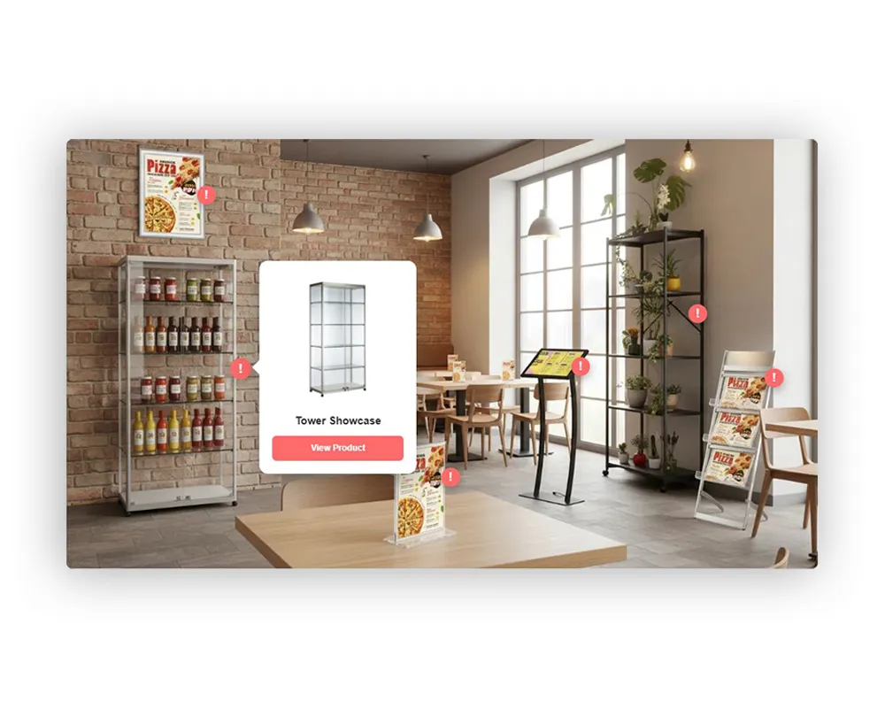
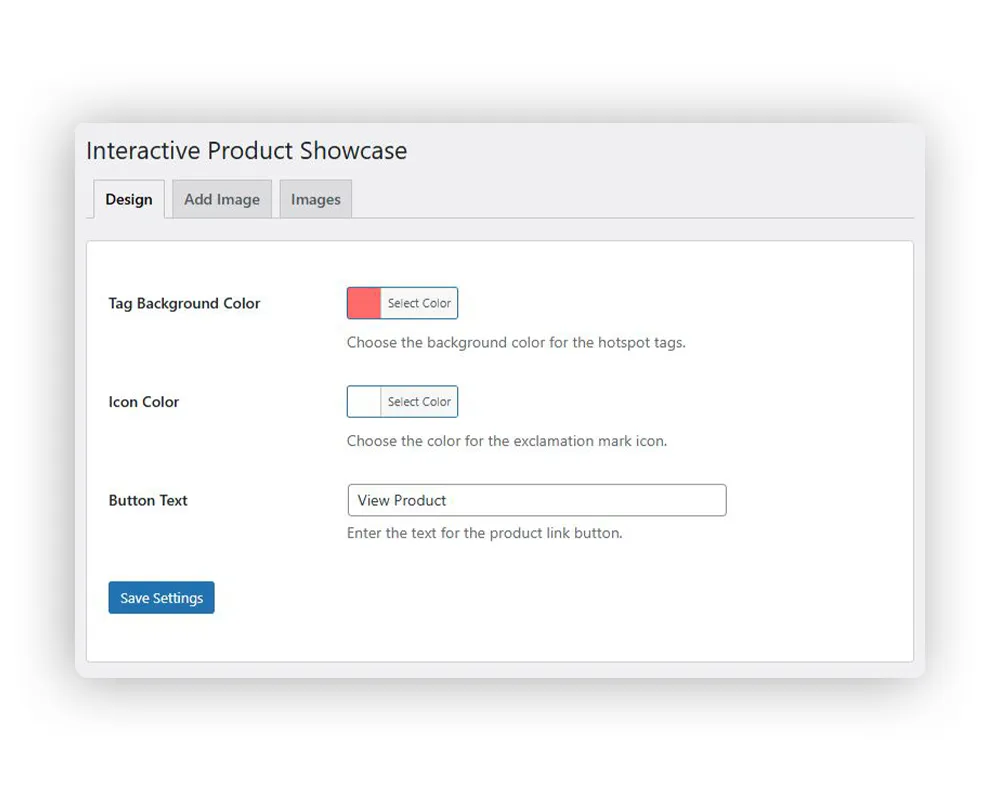
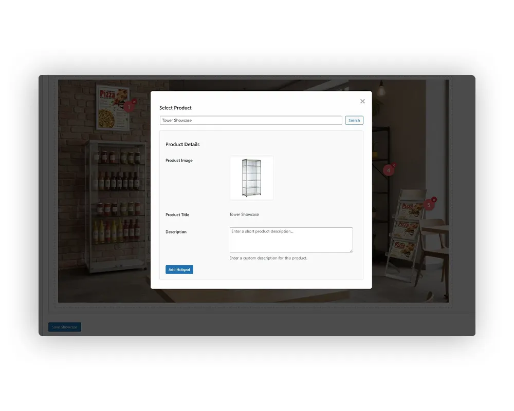
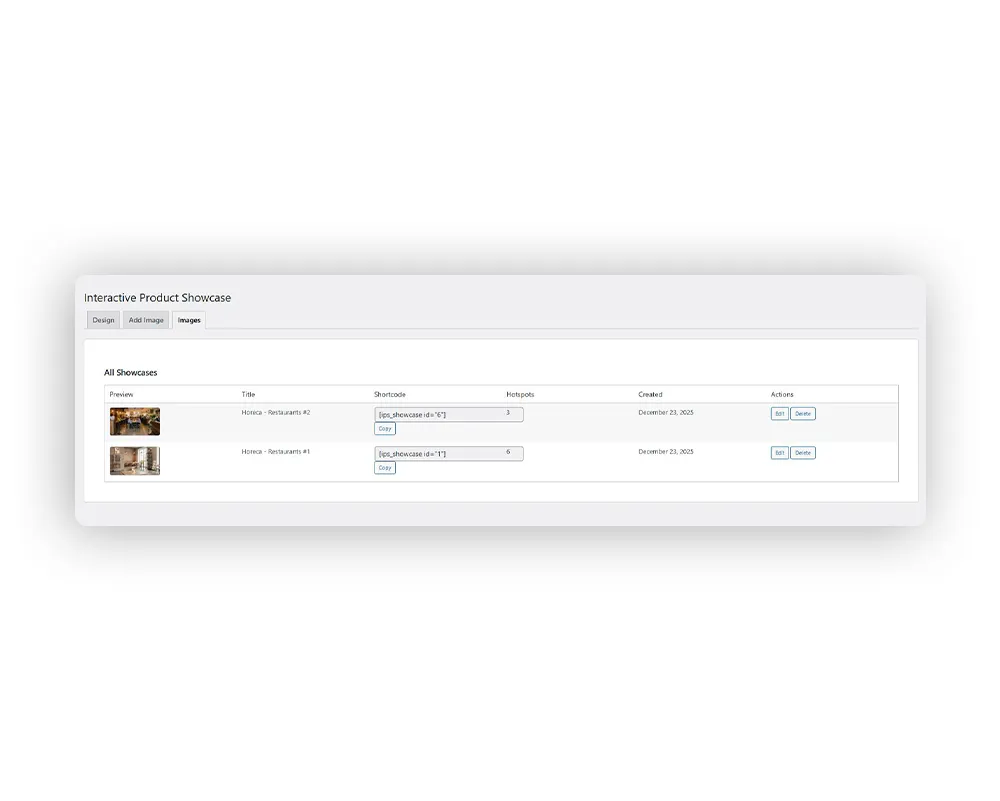

# 🎯 Interactive Product Showcase

A professional WordPress plugin that transforms static product images into interactive, clickable experiences with intelligent popup overlays. Built specifically for WooCommerce stores, this plugin enables merchants to create engaging visual product presentations where customers can explore multiple products within a single showcase image through intuitive hotspot interactions.

## 📸 Screenshots


*Interactive hotspots in action - Click anywhere on the image to add product hotspots*


*Customize colors and button text from the intuitive admin panel*


*Search and select products directly from your WooCommerce catalog*


*Manage all your interactive showcases in one place*

## ✨ Features

### 🎯 Interactive Hotspots
- Click-to-reveal product information overlays
- Smooth pulse animations to draw attention
- Unlimited hotspots per showcase image
- Drag-and-drop positioning in admin panel
- Real-time preview during creation

### 🎨 Customizable Design
- Color picker for hotspot background and icon colors
- Customizable button text for CTAs
- Automatic theme adaptation
- Professional animations and transitions
- Responsive design for all screen sizes

### 🛍️ WooCommerce Integration
- Direct product search from WooCommerce catalog
- Automatic product data import (title, image, URL)
- Custom product descriptions per hotspot
- Product thumbnail displays in popups
- Direct links to product pages

### 📱 Smart Responsive Positioning
- **Desktop:** Right-aligned popups with left fallback
- **Mobile:** Below-hotspot centered popups
- Intelligent overflow detection and adjustment
- Scroll-aware positioning that tracks viewport
- Arrow indicators showing hotspot relationship

### 💾 Database Architecture
- Custom tables for showcase storage
- JSON-based hotspot data structure
- Settings management system
- Efficient queries with prepared statements
- Support for multiple showcase instances per page

### 🔒 Security Implementation
- Nonce verification on all AJAX requests
- Capability checks (`manage_options`)
- Data sanitization (`sanitize_text_field`, `esc_url_raw`)
- SQL injection prevention via `$wpdb->prepare()`
- XSS protection (`esc_html`, `esc_attr`, `esc_url`)

### 📊 Admin Dashboard
- Three-tab interface: Design, Add Image, Images
- WordPress media library integration
- Real-time hotspot editor with visual feedback
- Shortcode generation and copy functionality
- Bulk showcase management

## 🚀 Installation

1. Download the plugin ZIP file
2. Upload to `/wp-content/plugins/interactive-product-showcase/`
3. Activate via WordPress admin panel (`Plugins > Installed Plugins`)
4. Navigate to `Interactive Product Showcase` in the admin menu

## 📖 Usage

### Setting Up Your First Showcase

1. **Configure Design Settings**
   - Go to `Interactive Product Showcase > Design`
   - Choose hotspot background color
   - Select icon color
   - Set button text (default: "View Product")
   - Click "Save Settings"

2. **Create a New Showcase**
   - Click the `Add Image` tab
   - Upload or select a product showcase image from media library
   - Click on the image to add hotspots at desired locations
   - For each hotspot:
     - Search for a WooCommerce product
     - Add custom description (optional)
     - Click "Add Hotspot"
   - Save the showcase

3. **Add to Your Pages**
   - Copy the generated shortcode: `[ips_showcase id="X"]`
   - Paste into any page, post, or widget
   - Publish and view your interactive showcase!

### Shortcode Usage

```
[ips_showcase id="1"]
```

Replace `1` with your showcase ID. You can find this in the `Images` tab.

## 🛠 Tech Stack

- **Backend:** PHP 7.4+, WordPress 6.0+ APIs, WooCommerce integration
- **Frontend:** Vanilla JavaScript (jQuery), HTML5, CSS3
- **Database:** WordPress wpdb abstraction layer with custom tables
- **Architecture:** Object-oriented PHP with singleton pattern
- **Admin Interface:** WordPress native UI components, media uploader, color picker
- **Styling:** Scoped CSS with unique identifiers, responsive design

## 📋 Requirements

- WordPress 6.0 or higher
- WooCommerce 5.0 or higher
- PHP 7.4 or higher
- Modern web browser

## 📂 File Structure

```
interactive-product-showcase/
├── assets/
│   ├── css/
│   │   ├── admin.css
│   │   └── frontend.css
│   ├── images/
│   │   └── placeholder.png
│   └── js/
│   │   └── admin.js
├── includes/
│   ├── class-ips-admin.php
│   ├── class-ips-database.php
│   └── class-ips-shortcode.php
├── languages/
│   └── interactive-product-showcase.pot
├── CHANGELOG.md
├── index.php
├── INSTALLATION.md
├── interactive-product-showcase.php
├── README.md
└── uninstall.php
```

## 💡 Impact & Results

✅ **User Experience Enhancement:** Transformed static product images into engaging, interactive experiences that increase customer engagement time on product pages

✅ **Conversion Optimization:** Direct product links in popups reduce friction in the buyer journey, enabling one-click navigation to product pages

✅ **Content Management:** Enabled store owners to showcase multiple products in a single lifestyle image, reducing page load times compared to traditional image grids

✅ **Mobile Optimization:** Responsive design ensures consistent experience across all devices, with touch-optimized interactions for mobile users

✅ **Developer-Friendly:** Clean, documented code with proper WordPress coding standards, making it easy to extend and customize

✅ **Performance:** Lightweight implementation with no external dependencies beyond WordPress and WooCommerce, minimal impact on page load times

✅ **Accessibility:** Keyboard navigation support, semantic HTML structure, and screen reader compatibility

## 🔐 Security Features

- All user inputs are sanitized using WordPress functions
- Database queries use prepared statements
- AJAX requests require valid nonces
- Administrative functions require proper capabilities
- XSS protection on all output

## 🐛 Troubleshooting

**Hotspots not appearing?**
- Ensure WooCommerce is activated
- Check that the shortcode ID matches an existing showcase
- Clear your browser cache

**Products not loading in admin?**
- Verify WooCommerce products exist
- Check database connection
- Review browser console for errors

**Styling conflicts?**
- Plugin uses scoped CSS with unique identifiers
- Check for theme conflicts
- Try disabling other plugins temporarily

## 🗺️ Roadmap

- [ ] Multi-language support (WPML compatibility)
- [ ] Advanced analytics tracking
- [ ] Hotspot templates library
- [ ] Video showcase support
- [ ] Custom animation options
- [ ] Export/Import functionality
- [ ] Role-based permissions

## 📜 License

This project is licensed under the MIT License. See the MIT License tab for details.

## 🤝 Contributing

Contributions, issues, and feature requests are welcome!

1. Fork the repository
2. Create your feature branch (`git checkout -b feature/AmazingFeature`)
3. Commit your changes (`git commit -m 'Add some AmazingFeature'`)
4. Push to the branch (`git push origin feature/AmazingFeature`)
5. Open a Pull Request

## 📧 Contact

For questions, feedback, or collaboration opportunities:

🌐 **Website:** [matrixprompter.com](https://matrixprompter.com)  
🔗 **All Links:** [linktr.ee/matrixprompter](https://linktr.ee/matrixprompter)  
📂 **Other Projects:** [matrixprompter/repositories](https://github.com/matrixprompter?tab=repositories)

---

Made with ❤️ by **[matrixprompter](https://matrixprompter.com/)**